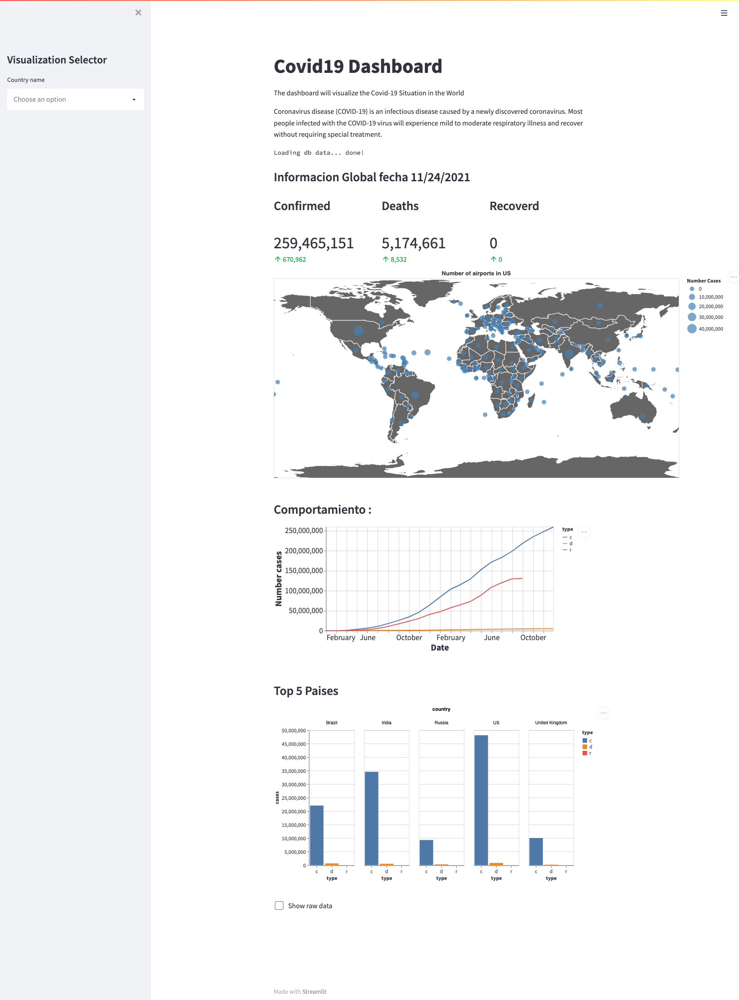
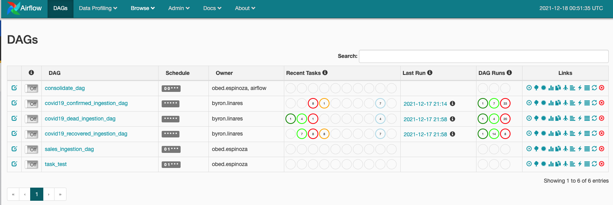

# Streamlit Covid19 Dashboard
Streamlit Project docs: https://streamlit.io/docs/

<p align="center">
  
</p>

Get the proyect 
## Clone
```sh
git clone https://github.com/bhlr/docker-airflow-streamlit.git
```
*Page: https://github.com/bhlr/docker-airflow-streamlit

# Running Covid19 ETL complete project

```sh
cd docker-airflow-streamlit
docker-compose build
docker-compose up
```
## What is getting done 
* Airflow workflow for etl proces.
* Postgresql for Airflow
* Mysql for datawarehouse 
* Streamlit app for dashboard visualization

## Airflow Configurations
##### .config/airflow.cfg
Dags folder :
` dags_folder = /usr/local/airflow/dags`   

Paused dags
> Note: `hide_paused_dags_by_default = False` is set in this proyect.

##### Default Connectios
This proyect requireds a set of default connectios :
* File sensor for folder monitor.
* Mysql sensor for datawarehouse

This conections are created by default on startup, to change this set the file  

`files/conn.json`

## ETL dag's
on ./dags/
Exists 3 etl dags for ingest data 
* covid19_recovered_ingest_dag.py
* covid19_dead_ingest_dag.py
* covid19_recovered_ingest_dag.py

#### Etl Description 
<p align="center">
  
</p>
   
* Each dag performs the same process, it has a sensor file to load for Confirmed, dead, recovered respectively in the monitor folder.
* When the presence of a file is detected, it is loaded into a panda dataframe.
* Transformed to the desired structure 
* And finally entered into a mysql database.

**To enter airflow admin go to :** http://localhost:8080/admin/

#### Dags code 

* Get connections
    ```
    FILE_CONNECTION_NAME = 'monitor_file'
    CONNECTION_DB_NAME = 'mysql_db'
    ```
* Get file 
    ```
    file_path = FSHook(FILE_CONNECTION_NAME).get_path()
    filename = 'time_series_covid19_confirmed_global.csv'
    ```
* Mysql connection 
    ```
    mysql_connection = MySqlHook(mysql_conn_id=CONNECTION_DB_NAME).get_sqlalchemy_engine()
    ```
* Read file to a panda's Dataframe
    ```
    full_path = f'{file_path}/{filename}'
    df = (pd.read_csv(full_path, encoding = "ISO-8859-1")
          .rename(columns=COLUMNS)
    )
    ```
* Transform data 
    ``` 
   df = df.melt(id_vars=["province", "country","lat","lon"],
        var_name="date",
        value_name="cases")
    df['date'] = pd.to_datetime(df['date'],format='%m/%d/%y')
    df["type"] = 'c'
    ```
* Insert to mysql table, delete previous data 
    ``` 
   with mysql_connection.begin() as connection:
        connection.execute("DELETE FROM test.covid19_cases WHERE type='c'")
        df.to_sql('covid19_cases', con=connection, schema='test', if_exists='append', index=False)
    ```

## Running Streamlit Covid19 docker built-in Stand-alone examples 
### Docker-compuse
```sh
cd streamlit-covid
docker-compuse up 
```
#### Go to 
Dashboard
` http://localhost:8501
Documentacion Dashboard
* https://github.com/bhlr/docker-airflow-streamlit/blob/main/streamlit-covid/README.md


