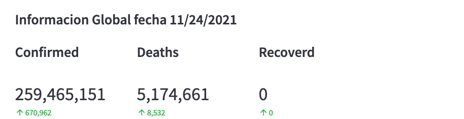
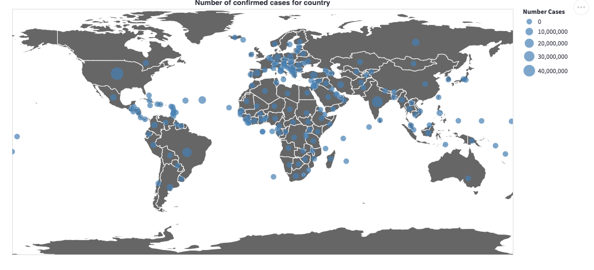
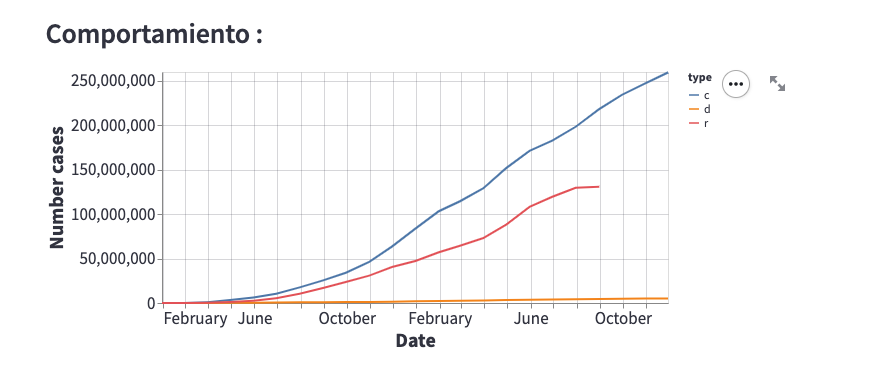
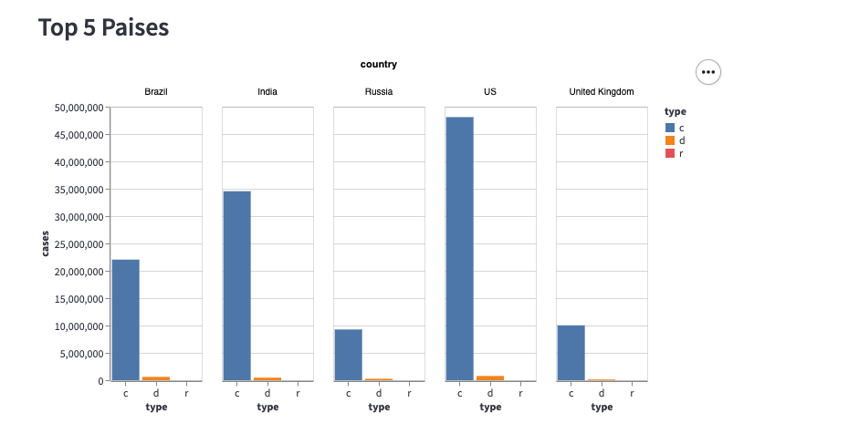
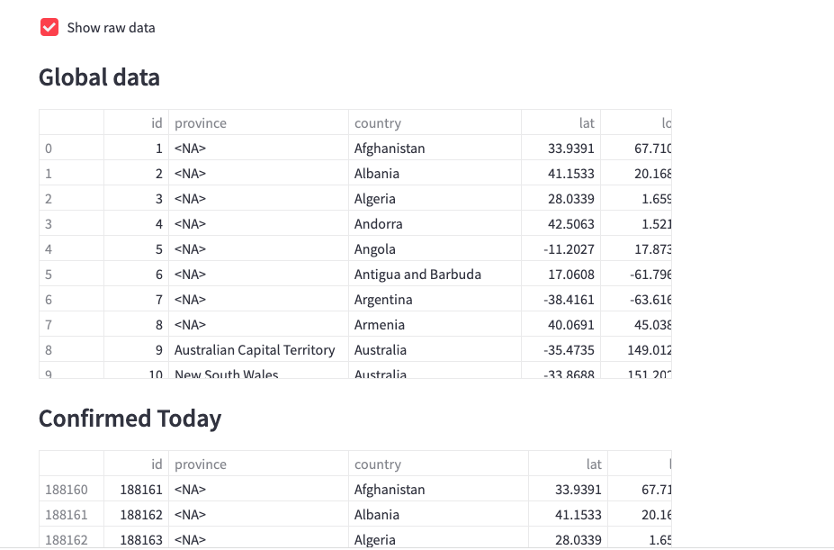
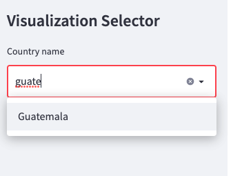
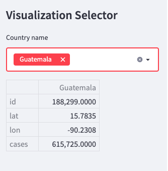
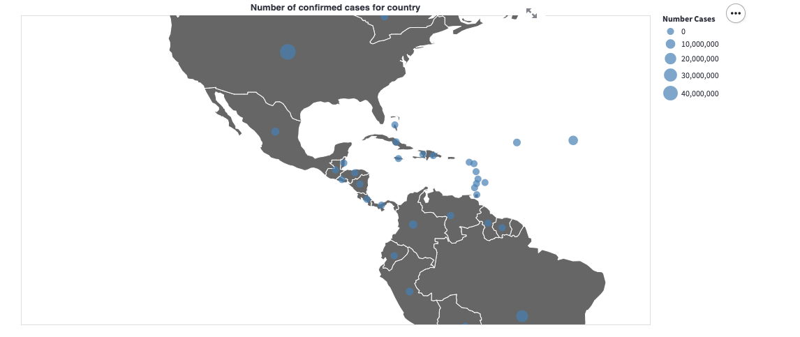

# Running Streamlit Covid19 docker built-in Stand-alone examples
**Streamlit Project docs:** https://streamlit.io/docs/

<p align="center">
  
</p>

## Running Covid19 ETL complete project
```sh
Docker-compuse
cd streamlit-covid
docker-compuse up 
```
Go to
` http://localhost:8501

## Editing the APP 

streamlite app uses a python code in folder `src/app.py`

## Stand-alon testing

For testing purpose the project can obtain its data from static files (Provided with the repository) one for each info : Confirmed, Dead, Recovered in a time series structure, this files are on `src/time_series_covid19_<type>.csv`

## Database Connection

For Database connection follow ths [Streamlit Documetation](https://docs.streamlit.io/knowledge-base/tutorials/databases/mysql)

This repository has included a demo connection on `.streamlit/secrets.toml`

## Dependencies 
`requirements.txt`
```
jsonschema==3.2
vega-datasets
mysql-connector-python
```

# Dashboard

#### Global Resume

<p align="center">
  
</p>

#### Wold Map

<p align="center">
  
</p>

#### Global Trend of cases

<p align="center">
  
</p>

#### Top 5 Countries with comfirmed cases
<p align="center">
  
</p>

#### Raw Data

<p align="center">
  
</p>

#### Filter for country search in data an world map

<p align="center">
  
</p>

<p align="center">
  
</p>

<p align="center">
  
</p>
